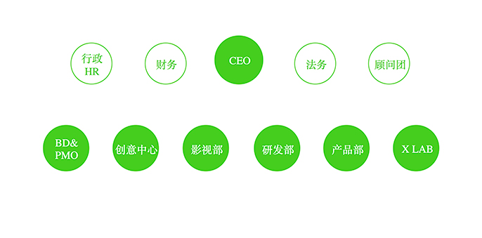

新员工引导
========

## 什么是广告、创意、设计 ##

* ****什么是广告****

  为无趣赋予有趣的灵魂

* ****什么是创意****

  用新的方式刷新用户的认知

* ****什么是设计****

  把不可能变成可能

## 公司愿景 ##

* 用创造力改变世人对广告的理解

## 行业影响力 ##

* 截止2018年1月30日 全国总版排名17

## 公司文化 ##

* 用户第一
* 勇于创新，敢于冒险
* 永远不说不可能
* 职业自由平等

## 公司架构 ##

## 项目流程 ##

## 设计规范 ##

## 快速入门 ##

* [快速入门](../快速入门/)
